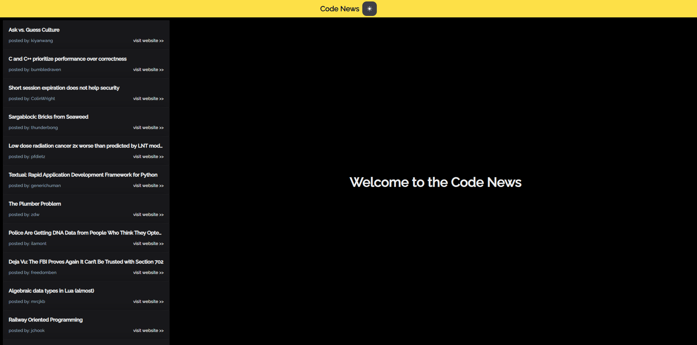
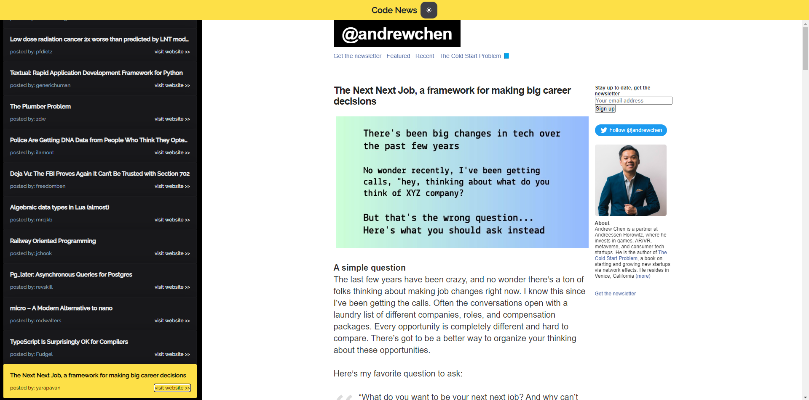
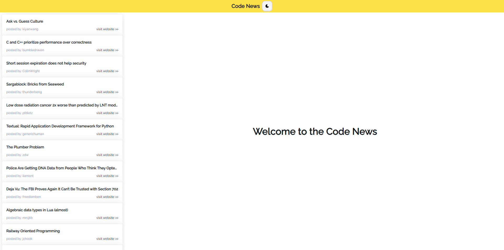
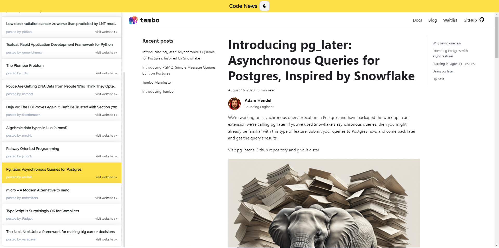
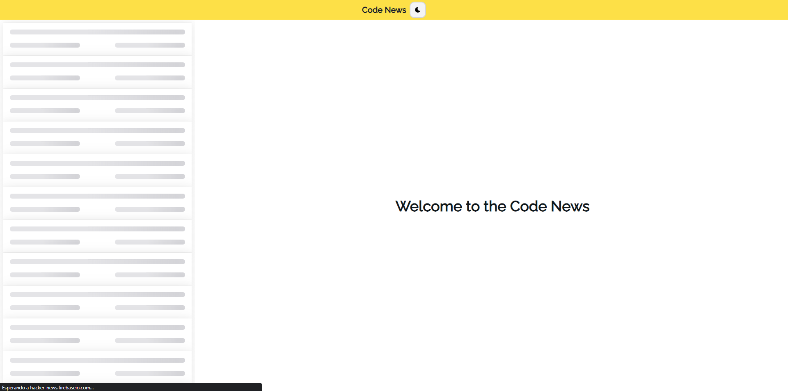

# Code News 🤩

Prueba técnica propuesta por [uizard](https://uizard.io/).

Es un clone de la web de Hacker News (https://news.ycombinator.com)


## Herramientas de desarrollo

 - Next Js
 - Zustand
 - NextUi & Tailwind CSS
 - Typescript


## ¿Cómo levantar el proyecto?

Es sencillo, realiza un git clone del proyecto después ejecuta los siguientes comandos:

```bash
  cd ./project-folder
```

```bash
  npm install
```

```bash
  npm run dev
```


## Authors

- [@githubpopckorn](https://github.com/githubpopckorn)


## Feedback

Si tienes algun feedback o recomendación puedes encontrarme en santy_lopez@live.com.ar


## 🚀 About Me
Full stack developer...


## License

[MIT](https://choosealicense.com/licenses/mit/)


## Screenshots

<div style="text-align:center">

<h3>Dark Mode 😎</h3>


<p></p>


<h3>Light Mode 🤩</h3>


<p></p>


<h3>Loader ⭕</h3>

</div>
